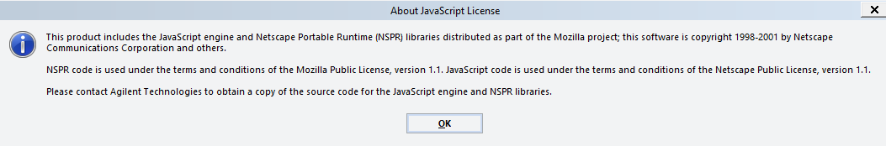

# VWorksExtLib 

Hello VWorkers.

welcome to Mauro's VWorks External Library!

The Agilent VWorks Automation Control software includes a very old JavaScript implementation of the Nescape Portable Runtime libraries that dates back to the late 1990's / early 2000's.

I think that it can be considered an implementation of the ECMAScript 3 (ES3) specifications, as [it includes RegEx, try-catch, switch and do-while](https://www.w3schools.com/Js/js_versions.asp). 

Having used VWorks' JS for almost ten years now I must say that it has all the essential features one needs to create useful code (functions, arrays, objects, RegExs and all their most important methods). Yet, it lacks some features that are nowadays taken for granted by all JS programmers, for example JSON support, arrow functions, destructuring assignments, const, let... and many, many, many methods that can make one's code more manageable and concise. While I certainly could not add the missing features to make VWorks' ES3 look like ES5 (there are [more specialized and professional projects](https://github.com/zloirock/core-js) for this), I decided to work on the missing methods and added some so-called "polyfills" that made my programming life easier along all these years. 

What I think makes this library special, though, is the fact that it was written for VWorks and the VWorks programmers. In fact, this library sports specific functions and methods that turn tedious protocol programming tasks into single calls. For example, `getWellselection()` converts a well address (for example "G10") to its wellselection form ([7,10]) and `plateInfo()` returns an object of plate parameters taken from the labware editor (and it works for both VWorks 13 and 14). These and more are described in the user manual below. 

Happy VWorks protocol programming!

Mauro

